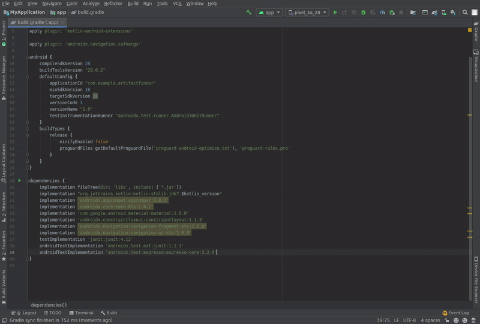

# Artifact Finder
Find maven artifacts by class names, extension methods or global methods.

## Disclaimer
This is **not** an official Google product.

## Why?
Did you ever start a new project and struggle to find the maven coordinates for
your favorite library? You know the class name you were using, but *what is the
maven coordinates* or *what is the latest version* ?
I personally did a lot so ended up creating this project.

## What is it?
This project has two main pieces:
* A java application `/artifactfinder` that can index maven artifacts (`jar`, `aar`).
This index includes a reverse mapping from class / method names to related artifacts.

* An Android Studio plugin which allows you to search this index and easily add
dependencies to your project.

## How do I add artifacts to be indexed?
Right now, only Google Maven and a few other Maven Central artifacts are indexed.

Eventually, there will be a json file that you can modify to add more artifacts
and send PRs but for now, external artifacts (non Google Maven) are listed
[here](artifactfinder/src/main/kotlin/com/birbit/artifactfinder/ExternalSources.kt)

## What is being indexed?
It currently indexes only `aar` and `jar` files in artifacts.
The indexer respects annotations like `RestrictTo` or skips any non-public class
(`internal`, `private` etc). Since `ktx` artifacts are a common case for AndroidX
artifacts, it also indexes extension methods and global kotlin methods.

There is also a bunch of hand written filters to avoid unnecessary common classes
(e.g. `R`, `BuildConfig`, `Dagger*Component`). It also tries to avoid any non-android
artifacts (e.g. Android Gradle Plugin).

## Where is the index?
Right now I host it on my personal droplet. There is a cron job that checks repositories
for updates every 15 minutes and also tries to download new artifacts.

You can directly query it in the following URL:

`curl -H "Accept: application/json" "https://birbit.com/searchArtifact?query=Room"`

Copyright:

    Copyright 2019 Google LLC

    Licensed under the Apache License, Version 2.0 (the "License");
    you may not use this file except in compliance with the License.
    You may obtain a copy of the License at

        https://www.apache.org/licenses/LICENSE-2.0

    Unless required by applicable law or agreed to in writing, software
    distributed under the License is distributed on an "AS IS" BASIS,
    WITHOUT WARRANTIES OR CONDITIONS OF ANY KIND, either express or implied.
    See the License for the specific language governing permissions and
    limitations under the License.
